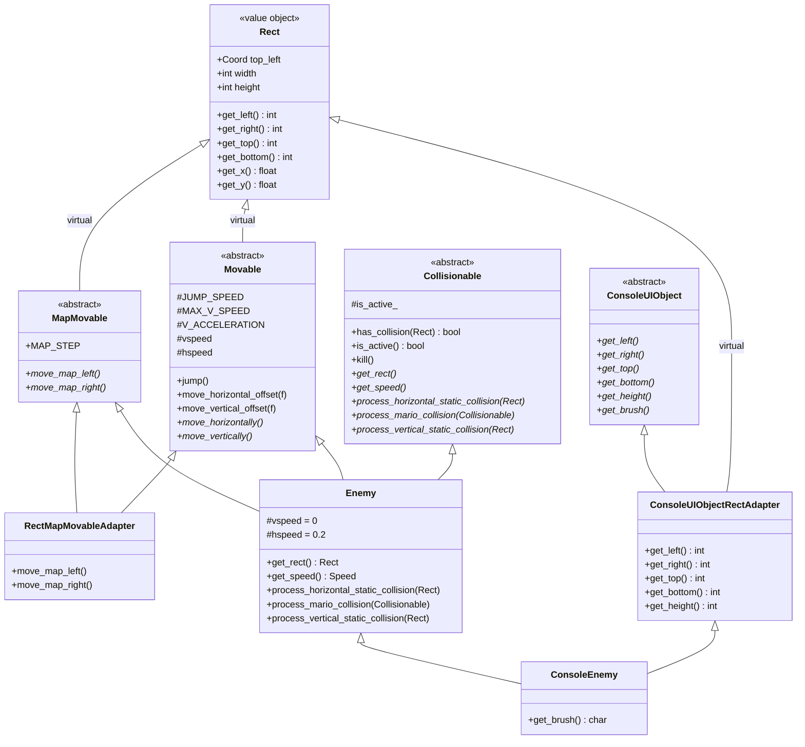
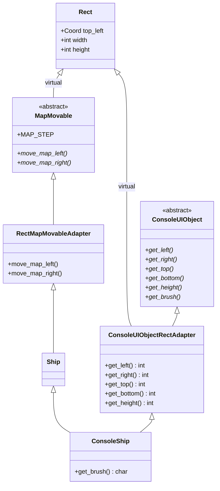

# Диаграммы наследования

Задание 1 из `README.md`:

> Изучить наследование на примере построения диаграмм иерархий для классов:
> ConsoleEnemy, ConsoleShip.

Все диаграммы построены по фактическим объявлениям классов в `src/`.

---

## 1. ConsoleEnemy

Объявление (`src/ui/console/ui_objects/console_enemy.hpp`):

```cpp
class ConsoleEnemy : public Enemy, public ConsoleUIObjectRectAdapter
```

Разворачивая базовые классы рекурсивно, получаем **три независимых пути**
к `Rect` — через `RectMapMovableAdapter`, через `Movable` и напрямую через
`ConsoleUIObjectRectAdapter`.

```
                        ┌──────────────────────────────────┐
                        │              Rect                │
                        │  top_left, width, height         │
                        │  get_left/right/top/bottom/x/y   │
                        └────────────────┬─────────────────┘
                                         │
        ╔════════════════════════════════╪════════════════════════════════╗
        ║  virtual                       │  virtual          virtual     ║
        ║                                │                                ║
┌───────┴────────────────┐   ┌───────────┴──────────┐   ┌─────────────────┴───────────────┐
│ RectMapMovableAdapter  │   │       Movable        │   │ ConsoleUIObjectRectAdapter      │
│                        │   │                      │   │                                 │
│ move_map_left()        │   │ JUMP_SPEED           │   │ get_left/right/top/bottom/     │
│ move_map_right()       │   │ MAX_V_SPEED          │   │   height  → Rect::*            │
└───────┬────────────────┘   │ V_ACCELERATION       │   │                                 │
        │                    │                      │   │ get_brush() = 0  (чисто       │
        │                    │ jump()               │   │   виртуальный)                  │
┌───────┴────────┐           │ move_horizontal_     │   │                                 │
│   MapMovable   │           │   offset()           │   │                                 │
│  (abstract)    │           │ move_vertical_offset │   │                                 │
│                │           │ move_horizontally()  │   │                                 │
│ move_map_left()│           │ move_vertically()    │   │                                 │
│ move_map_right()│          └───────────┬──────────┘   └─────────────────┬───────────────┘
└───────┬────────┘                       │                                │
        │                                │                        ┌───────┴────────┐
        │                                │                        │ConsoleUIObject│
        │                                │                        │  (abstract)   │
        │                                │                        │               │
        │                                │                        │ get_left()…   │
        │                                │                        │ get_brush()   │
        │                                │                        └────────────────┘
        └────────────────┬───────────────┘
                         │
                ┌────────┴─────────┐        ┌──────────────────┐
                │      Enemy       │───────▶│  Collisionable   │
                │                  │  impl  │  (abstract)      │
                │ vspeed = 0       │        │                  │
                │ hspeed = 0.2     │        │ has_collision()  │
                │                  │        │ is_active()      │
                │ get_rect()       │        │ kill()           │
                │ get_speed()      │        │ get_rect() = 0   │
                │ process_*_collision() │  │ get_speed() = 0  │
                └────────┬─────────┘        │ process_*_…()= 0 │
                         │                  └──────────────────┘
        ╔════════════════╪══════════════════════════════╗
        ║                                                ║
┌───────┴────────┐                              ┌────────┴───────────────────────┐
│ ConsoleEnemy   │                              │ ConsoleUIObjectRectAdapter     │
│                │                              │                                │
│ get_brush()    │                              │ (уже показан выше)             │
│   → 'e'        │                              │                                │
└────────────────┘                              └────────────────────────────────┘
```

**Путей к `Rect` — три.** Именно поэтому все три базы объявлены как
`virtual public Rect`.

---

## 2. ConsoleShip

Объявление (`src/ui/console/ui_objects/console_ship.hpp`):

```cpp
class ConsoleShip : public Ship, public ConsoleUIObjectRectAdapter
```

```
                        ┌──────────────────────────────────┐
                        │              Rect                │
                        │  top_left, width, height         │
                        └────────────────┬─────────────────┘
                                         │
        ╔════════════════════════════════╪═════════════════════════╗
        ║  virtual                       │  virtual                 ║
        ║                                │                          ║
┌───────┴────────────────┐   ┌───────────┴──────────────────┐       │
│ RectMapMovableAdapter  │   │ ConsoleUIObjectRectAdapter   │       │
│ move_map_left()        │   │ get_left/right/top/bottom →  │       │
│ move_map_right()       │   │   Rect::*                    │       │
└───────┬────────────────┘   │ get_brush() = 0               │       │
        │                    └───────────┬──────────────────┘       │
┌───────┴────────┐                       │                  ┌───────┴────────┐
│   MapMovable   │                       │                  │ConsoleUIObject│
│  (abstract)    │                       │                  │  (abstract)   │
└───────┬────────┘                       │                  └────────────────┘
        │                                │
        └───────────────┬────────────────┘
                        │
                ┌───────┴────────┐
                │      Ship      │  (пустой класс: только конструктор,
                │                │   передаёт top_left/width/height
                │                │   в RectMapMovableAdapter)
                └───────┬────────┘
                        │
        ╔═══════════════╪══════════════════════════╗
        ║                                              ║
┌───────┴────────┐                            ┌───────┴────────────────────┐
│  ConsoleShip   │                            │ ConsoleUIObjectRectAdapter │
│                │                            │                            │
│ get_brush()    │                            │                            │
│   → '#'        │                            │                            │
└────────────────┘                            └────────────────────────────┘
```

**Путей к `Rect` — два.** `Ship` ничего не добавляет к поведению: это
чистое наследование ради повторного использования `RectMapMovableAdapter`
и для единообразия иерархии.

---

## 3. Сводка: сколько путей ведёт к `Rect`

Это главный практический вывод задания. Число путей = числу базовых
классов в цепочке, объявленных как `virtual public Rect`.

| Консольный класс | Цепочка баз до `Rect` | Путей | Виртуальное наследование |
|---|---|---|---|
| `ConsoleEnemy` | `Enemy` → `RectMapMovableAdapter`, `Enemy` → `Movable`, `ConsoleUIObjectRectAdapter` | **3** | обязательно |
| `ConsoleMoney` | `Money` → `RectMapMovableAdapter`, `Money` → `Movable`, `ConsoleUIObjectRectAdapter` | **3** | обязательно |
| `ConsoleShip` | `Ship` → `RectMapMovableAdapter`, `ConsoleUIObjectRectAdapter` | 2 | обязательно |
| `ConsoleBox` | `Box` → `RectMapMovableAdapter`, `ConsoleUIObjectRectAdapter` | 2 | обязательно |
| `ConsoleMario` | `Mario` → `Movable`, `ConsoleUIObjectRectAdapter` | 2 | обязательно |
| `ConsoleFullBox` | `FullBox` → `Box` → `RectMapMovableAdapter`, `ConsoleUIObjectRectAdapter` | 2 | обязательно |

Уберите `virtual` хотя бы у одной базы — и `ConsoleEnemy` перестанет
компилироваться с ошибкой неоднозначного базового класса (`ambiguous
base class`). Проверяется тривиально: заменить в
`rect_map_movable_adapter.hpp` `virtual public Rect` на `public Rect` и
собрать проект.

---

## 4. Для контекста: остальные четыре иерархии

Они не входят в задание, но показывают, что правило применяется везде
одинаково.

### ConsoleMario

```
Rect (virtual) ──┬── Movable ──┐
                 │              ├── Mario ──┐
                 │              │           │
                 │              │  + Collisionable (abstract)
                 │              │           │
                 └── ConsoleUIObjectRectAdapter
                                │           │
                                │      ConsoleMario  → get_brush() = '@'
                                └── ConsoleUIObject (abstract)
```

### ConsoleBox

```
Rect (virtual) ──┬── MapMovable ──┐
                 │                 ├── RectMapMovableAdapter ──┐
                 │                 │                           ├── Box ──┐
                 │                 │                           │         │
                 │                 │                           │  + Collisionable
                 │                 │                           │         │
                 └── ConsoleUIObjectRectAdapter ───────────────┴─────────┴── ConsoleBox → '-'
```

### ConsoleFullBox

```
Rect (virtual) ──┬── MapMovable ──┐
                 │                 ├── RectMapMovableAdapter ──┐
                 │                 │                           ├── Box ──┐
                 │                 │                           │         ├── FullBox ──┐
                 │                 │                           │         │  + Collisionable
                 │                 │                           │         │
                 └── ConsoleUIObjectRectAdapter ───────────────┴─────────┴── ConsoleFullBox → '?'
```

### ConsoleMoney

```
                       ┌── Movable ──┐
Rect (virtual) ─────────┤             ├── Money ──┐
                       │             │           │
                       │             │  + Collisionable (abstract)
                       │             │           │
                       └── ConsoleUIObjectRectAdapter
                                     │      ConsoleMoney → get_brush() = '$'
                                     └── ConsoleUIObject (abstract)
```

> ВНИМАНИЕ. В `ConsoleMoney` выше показан лишь путь через `Movable`.
> `Money` также наследует `RectMapMovableAdapter` — полная иерархия
> совпадает с `ConsoleEnemy`, как и в таблице из раздела 3.

---

## 5. Диаграммы в формате Mermaid

Для вставки в README или отчёт (GitHub отрисует автоматически).

### ConsoleEnemy



### ConsoleShip



---

## 6. Ответ на вопрос из `rect_map_movable_adapter.hpp`

> `- Почему класс Rect наследуется виртуальным образом?`

**Вdiamond-наследовании.** `ConsoleEnemy` наследует `Rect` тремя
независимыми путями (раздел 1). При невиртуальном наследовании в объекте
`ConsoleEnemy` оказалось бы **три отдельных подобъекта `Rect`**, каждая
со своим `top_left`/`width`/`height`.

Последствия:

1. **Неоднозначность при обращении.** `enemy.get_left()` — к какой из трёх
   копий обращаться? Компилятор выдаёт `ambiguous base class`.
2. **Расхождение состояния.** `RectMapMovableAdapter` двигает карту через
   `top_left.x -= MAP_STEP`, а `ConsoleUIObjectRectAdapter::get_left()`
   читает `Rect::get_left()` от **другой** копии. Отрисовка в
   `ConsoleGameMap::refresh()` уехала бы от логики.

Виртуальное наследование гарантирует **единственный** общий подобъект
`Rect` на весь граф наследования. Инициализировать его должен только
конструктор самого верхнего класса (`Enemy`, `Ship`, `Money` и т. д.),
что и происходит:

```cpp
ConsoleEnemy::ConsoleEnemy(const Coord& t, int w, int h)
    : Enemy(t, w, h) {}   // Enemy инициализирует единственную Rect
```

Обратите внимание на цепочку передачи ответственности: `ConsoleEnemy` →
`Enemy` → `RectMapMovableAdapter(top_left, width, height)`, и
`ConsoleUIObjectRectAdapter` использует конструктор по умолчанию
(`= default`), не трогая `Rect`. Это и есть признак корректного
виртуального наследования.

> Дополнительный нюанс: `Rect` сам не является абстрактным классом и
> имеет конструктор по умолчанию. Строго говоря, для разделения
> интерфейса и реализации следовало бы сделать `Rect` абстрактным, но
> автор оставил его конкретным — это упрощает создание объектов
> вроде `Rect{top_left, width, height}`, которое активно используется в
> `get_rect()`.
